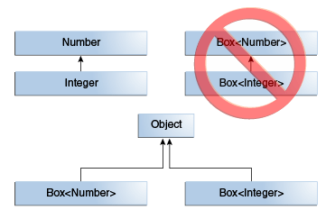

# Tutorial Java Generic
#
#
## 1. Pendahuluan
Java Generic adalah kemampuan dalam bahasa pemprograman Java untuk membuat tipe parameter yang umum. Sederhananya tipe yang bisa menampung data apa saja. Semisal kita membuat class Box yang bisa menampung nilai Integer.
```Java
public class Box {
	private Integer int;

	public Box(Integer i) {
		int = i;
	}

	public Integer get() {
		return int;
	}
	...
}
```
Semisal kita ingin class Box yang menyimpan data Double, String, dll, maka kita buat satu-satu atau dengan menggunakan tipe Object.
```Java
public class Box {
	private Object obj;

	public Box(Object o) {
		obj = o;
	}

	public Object get() {
		return obj;
	}
	...
}
```
Maka class Box dapat menampung tipe apa saja, yang jadi masalah ketika proses verifikasi saat kompilasi, maka nilai kembalian akan bertipe Object. Otomatis memungkinkan terjadi kesalahan kondisi, dll. Misal kita masukan nilai Integer pada Box Object, lalu kita ambil nilai untuk kita bandingkan pada sebuah kondisi jika data tersebut > 100.
```Java
BoxObj boxObj = new BoxObj(200);

if(boxObj.get() > 100) {	// Eror
	System.out.println("greater than 100");
}
```
Ouput.
```Bash
Main.java:36: error: bad operand types for binary operator '>'
                if(boxObj.get() > 100) {
                                ^
  first type:  Object
  second type: int
```
Pada contoh di atas akan eror karena nilai kembalian dari fungsi get() adalah Object. Maka kita bisa gunakan generic untuk mengatasinya, contoh class Box bertipe Generic.
```Java
class BoxGeneric<T> {
	private T data;

	public BoxGeneric(T data) {
		this.data = data;
	}

	public T get() {
		return this.data;
	}
}
```
Lalu kita coba buat objeknya dan uji dengan kondisi (data > 100).
```Java
BoxGeneric<Integer> bg = new BoxGeneric<Integer>(500); // Box bertipe Integer

if(bg.get() > 100) {
	System.out.println("greater than 100");
}
```
Output.
```Bash
greater than 100
```
Tidak terjadi eror karena nilai kembalian akan bertipe Integer.

## 2. Generic
Untuk menandai sebuah class/interface/method menjadi generic cukup tambahan simbol (< tipe_parameter >), maka akan menjadi generic.
```Java
// Format
class nama<T1, T2, ..., Tn> {
	...
}
```
Huruf T hanya sebagai simbol untuk tipe parameter dari kelas itu, Generic disimbolkan dengan kurung (<>) setelah nama kelas. Buat kelas Box dengan cara Generic dengan menambahkan <> & nama parameter T setelah nama kelas.  
```Java
/**
  * Versi Generic dari kelas Box
  * @param <T>  untuk tipe data.
  */
public class Box<T> {
	// T untuk tipe
	private T data;

	public Box(T value) {
		data = value;
	}

	public T get() {
		return data;
	}
	...
}
```
Agar mudah dipahami semisal kita membuat objek Box dengan tipe Integer maka akan seperti ini.
```Java
public class Box<Integer> {
	
	private Integer data;

	public Box(Integer value) {
		data = value;
	}

	public Integer get() {
		return data;
	}
	...
}
```
## 3. Penulisan Tipe Generic
Penulisan Tipe Generic mengikuti standar Java, ditulis dengan huruf kapital.  

- E : Elemen
- K : Key/Kunci
- N : Number/Bilangan
- T : Type/Tipe
- V : Value/Nilai
- S,U,V etc. - 2nd, 3rd, 4th, ...

## 4. Pembuatan Generic
Pada saat pembuatan objek generic, memasukan tipe data disebut dengan ***generic type invocation***, yaitu mengganti pada huruf T dengan tipe data objek (Integer, Double, dll).  
```Java
Box<Integer> box;
```
***"Istilah Tipe Parameter & Tipe Argumen: kebanyakan developer
Menggunakan istilah tipe parameter & tipe argumen, tipe parameter
adalah jenis tipe generic dari parameter Box< T >, jika tipe argumen
adalah tipe objek dari argumen Box< String >"***

## 5. Diamond
Di **Java SE > 7** tidak perlu menulis tipe argumen pada bagian constructor pembuatan objek generic, hanya menulis simbol generic (<>), ini disebut dengan ***diamond.***
```Java
/**
 * Contoh Diamond
 */ 
// Tanpa diamond Java SE < 7
Box<String> boxString = new Box<String>(); 

// Dengan diamond Java SE > 7
Box<String> boxString = new Box<>(); 
```

## 6. Beberapa Tipe Parameter
Tipe Parameter Generic bisa lebih dari 1 dan bisa bertipe sama. Gunakan tanda ( , ) setelah tipe pertama, jika nama tipe parameter sama maka nama harus beda. Ingat simbol pada parameter hanyalah seperti nama variabel.  
```Java
/**
 * Contoh Multi Tipe Parameter Berbeda
 * @param K	Untuk key/kunci, bertipe nilai
 * @param V	Untuk value/nilai, bertipe karakter/string
 */ 
class Person<K, V> {
	private K noHP;
	private V name;

	public Person(K k, V v) {
		this.noHP = k; 
		this.name = v;
	}

	public void show() {
		System.out.println(this.noHP);
		System.out.println(this.name);
	}
}

// Main Program
public class MultipleParameter {
	public static void main (String[] args) {
		Person<Integer, String> person1 = new Person<>(08151213, “Joni”);
		person1.show();
	}
}
```

## 7. Subtitute Parameter
Pada tipe parameter generic bisa dimasukan Objek lain seperti memasukan objek Stack, ArrayList, atau objek lain.
```Java
Person<String, Stack<Integer>> p2 = new Person<>("Jammy", new Stack<Integer>());

...
```

## 8. Tipe Mentah
Tipe mentah (Raw Types) adalah jenis objek generic yang tidak ditetapkan tipe datanya. Sebagai contoh dengan class Box.
```Java
public class Box<T> {
    public void set(T t) { /* ... */ }
    // ...
}
```
Jika membuat objek generic seperti biasa akan seperti ini.
```Java
	Box<Integer> intBox = new Box<>();
```
Sedangkan yang disebut ***Raw Types*** adalah kita tidak memberikan tipe argumen apapun.
```Java
	Box rawBox = new Box();
```
Ini berati Box adalah tipe raw dari Box<T>, jika non-generic class atau interface bukan tipe mentah.
Akan terjadi ***Warnings*** jika menetapkan objek dari tipe mentah ke tipe generic atau sebaliknya.
```Java
Box rawBox = new Box();           // Tipe mentah
Box<Integer> intBox = rawBox;     // warning: unchecked conversion

// ===

Box<String> stringBox = new Box<>();
Box rawBox = stringBox;
rawBox.set(8);  // warning: unchecked invocation to set(T)
```

## 9. Generic Method
Fungsi atau ***Method*** statik/non-statik dapat dibuat menjadi generic disebut ***Generic Method*** yang memiliki tipe parameter tersendiri. Untuk formatnya:
```Java
...
	public static <T> print(T data) {
		System.out.println(data);
	}

	// Juga bisa berbagai tipe parameter.
	public static <K, V> some() {
		...
	}
...
```

## 10. Bounded Type Parameter
Membatasi tipe parameter pada tipe tertentu, semisal hanya mengijinkan tipe data dari ***Number***.
```Java
// Format
... <T,... extends class/interface> tipe_return ...
```
Contoh fungsi isEvenNumber(x), fungsi mengecek apakah nilai yang dimasukan nilai genap?
```Java
...
	public static <T extends Number> boolean isEvenNumber(T val) {
		Number n = val;
		return (int)n % 2 == 0;
	}
...
```
#### Banyak Tipe Parameter
Untuk jumlah tipe parameter bisa lebih dari satu, tetapi harus urut sesuai tingkatan jika tidak akan eror.
```Java
// Format
... <T extends class/interface & class/interface & ... > tipe_return ...
```

## 11. Generic Method & Bounded Types
Bouded Types sering digunakan untuk membuat algoritma yang generic. Contoh fungsi membandingkan nilai pada array dengan nilai masukan.
```Java
public static <T> int countGreaterThan(T[] anArray, T elem) {
	int count = 0;
	for (T e : anArray)
		if (e > elem)  // eror kompilasi
					   // Hanya untuk tipe primitif
			++count;
	return count;
}
```
Untuk solusinya kita buat interface Comparable.
```Java
public interface Comparable<T> {
    public int compareTo(T o);
}
```
Maka fungsi akan seperti ini.
```Java
public static <T extends Comparable<T>> int countGreaterThan(T[] anArray, T elem) {
    int count = 0;
    for (T e : anArray)
        if (e.compareTo(elem) > 0)
            ++count;
    return count;
}
```

## 12. Generic, Inheritance, Subtype
Generic juga dapat memasukan objek turunan (inheritance). Contoh membuat objek Box tipe Number maka kita bisa memasukan data turunan Number (Integer, Double, dll).
```Java
Box<Number> box = new Box<Number>();
box.add(new Integer(10));   // OK
box.add(new Double(10.1));  // OK
```
Lalu coba kita buat fungsi yang menerima tipe Box<Number>.
```Java
public void boxTest(Box<Number> n) { /* ... */ }
```
Maka yang dapat kita masukan hanya Box<Number>, jika memasukan Box<Integer>, Box<Double>, otomatis tidak bisa karena Box<Integer> atau Box<Double> bukan turunan Box<Number>.  



## 13. Wildcards
Pada Generic, simbol tanda tanya (?) disebut ***Wildcards*** yang berati tipe tidak diketahui. Wildcards dapat dipakai di tipe parameter, field, tipe kembalian.  

## 14. Upper Bounded Wildcards
Membatasi tipe data tertentu pada tipe parameter, semisal tipe data bilangan seperti Integer, Double, dll. Digunakan pada tipe parameter, berbeda dengan Bounded Types Parameter.
```Java
	...<? extends class/interface> ...
```
Sebagai contoh kita buat fungsi penjumlahan dari List tipe Number.
```Java
public double sumOfList(List<? extends Number> list) {
	double result = 0.0d;
	for(Number e : list) {
		result += e;
	}
	return result;
}
```
Lalu untuk demonya:
```Java
List<Integer> listA = List.of(100, 200, 300);
List<Double> listB = List.of(10.10, 20.5, 1.5);

System.out.println(sumOfList(listA));
System.out.println(sumOfList(listB));
```
Output:
```Bash
600
32,1
```

## 15. Unbounded Wildcards
Digunakan ketika ingin menerima tipe data yang umum seperti objek, gunakan simbol (?). Pada tipe generic maka disebut unknown type/tipe tidak diketahui. Ini sering
diimplementasikan pada fungsi yang bersifat umum, seperti fungsi print data list.  
Contoh membuat fungsi menampilkan data list dengan tipe data parameter Object.  
```Java
public static void printList(List<Object> list) {
	for(Object e : list) {
		System.out.print(e+" ");
	}
	System.out.println();
}
```
Otomatis fungsi tersebut bisa berkerja untuk tipe data ***Object*** dan ***Subtype*** nya. Tetapi yang jadi masalah ketika kita masukan tipe Object seperti ***Integer***, ***Double***, ***String***, dll, karena bukan ***subtype*** dari ***Object***. Maka ganti dengan (?) otomatis tipe data jenis apapaun akan bisa diterima.  
```Java
public static void printList(List<?> list) {
	for(Object e : list) {
		System.out.print(e+" ");
	}
	System.out.println();
}
```
Maka fungsi bisa menerima tipe data selain ***Object***.  
```Java
List<String> lisA = List.of("Joni", "Frank", "Jammy");
List<Integer> listB = List.of(100,200,300,400);
	
printList(listA);
printList(listB);
```
Output:
```Bash
Joni Frank Jammy
100 200 300 400
```

## 16. Lower Bounded Wildcards
Jika Upper Bounded adalah turunan dari tipe tersebut, maka Lower Bounded adalah supertype/parent dari tipe tersebut. Semisal hanya ingin supertype dari tipe Integer maka otomatis tipe yang diijinkan dalah Integer, Number, Object.
```Java
... <? super class/interface> ...
```
Contoh sebuah fungsi yang memasukan nilai ke objek dari input parameter.
```Java
public static void addInteger(List<? super Integer> list) {
	for(int i = 0; i < 10; i++) {
		list.add(i);
	}
}
```
Uji dengan memasukan objek List.
```Java
List<Integer> list1 = new ArrayList<Integer>();
Utility.addInteger(list1);

System.out.println(list1.toString());	
```
Output.
```Bash
[0, 1, 2, 3, 4, 5, 6, 7, 8, 9]
```

## 17. Wildcards and Subtyping
Wildcards juga dapat digunakan untuk membuat hubungan antara ***class*** & ***interface***.
Sebagai contoh  

- Membuat interface A  
- Membuat class B dengan extends interface A  

## 18. Tipe Erasure
Generic diperkenalkan pada Java guna mendukung kompilasi dan generic programming. Yang dilakukan ***compiler*** ke ***generic*** adalah.

- Mengganti semua tipe generic menjadi Object jika tipe unbounded.
- Mengganti semua tipe generic menjadi tipe yang di tuju jika tipe generic bounded.

#### Contoh pada tipe parameter
**1. Contoh tipe unbounded**  
Ada class generic bernama Node representasi node single linked list.
```Java
public class Node<T> {

	private T data;
	private Node<T> next;

	public Node(T data, Node<T> next) {
		this.data = data;
		this.next = next;
	}

	public T getData() {
		return data;
	}
	// ...
}
```

Karena tipe paramter adalah unbouded maka akan dirubah menjadi Object.

```Java
public class Node {

    private Object data;
    private Node next;

    public Node(Object data, Node next) {
        this.data = data;
        this.next = next;
    }

    public Object getData() { return data; }
    // ...
}
```

**2. Contoh tipe bounded**  
Menggunakan class node tetapi bertipe bounded parameter.
```Java
public class Node<T extends Comparable<T>> {

	private T data;
	private Node<T> next;

	public Node(T data, Node<T> next) {
		this.data = data;
		this.next = next;
	}

	public T getData() {
		return data;
	}
	// ...
}
```
Maka yang terjadi adalah compiler merubah tipe T menjadi Comparable.

```Java
public class Node {

    private Comparable data;
    private Node next;

    public Node(Comparable data, Node next) {
        this.data = data;
        this.next = next;
    }

    public Comparable getData() {
    	return data;
    }
    // ...
}
```

Hal ini juga berlaku untuk generic method.

## 19. Bridge Method


